#### Forest Health Calculator:

Forests play an integral role in providing habitat to animals, livelihood to humans, watershed protection, preventing soil erosion and mitigating climate change. Unfortunately, Pakistan is a forest poor country having 5% forest cover area which is under rapid degradation with an annual deforestation rate of 1.5%. This adversely affects the biodiversity of the forest areas, leading to a loss of habitat as well as affecting the livelihood of local communities. Manual forest monitoring systems are now insufficient for forest conservation and reforestation. We aim to provide automated forest health monitoring system with least human intervention. 

To take our part for solving above mentioned issues, we have begun with carbon sequestration estimation, required to stave off global warming. CO2 is the key greenhouse gas emitted by cars and power plants. Trees, the kings of the plant world, have much woodier biomass for carbon sequestration and ultimately causing climate change mitigation.  Tree height and its diameter at breast height are the key parameters for volume and biomass calculation that is eventually required for estimating carbon stock. However, the imprecise manual strategies lead to uncertain height and biomass estimation, which is finally unable to meet the requirement of the accurate carbon accounting. To achieve our aim, we have developed an android based application named ‘Forest Health Calculator’ for finding tree height, volume, biomass and carbon content using forest images captured by mobile camera, deep learning models, and computer vision algorithms.

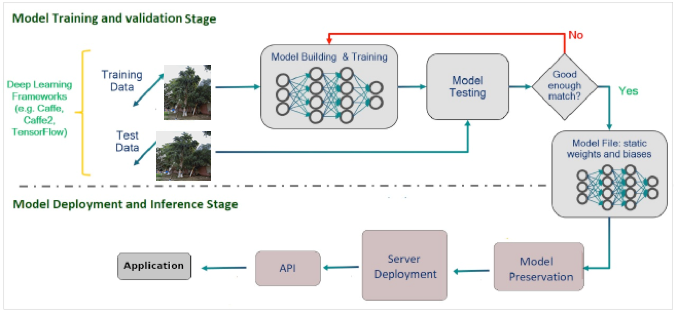

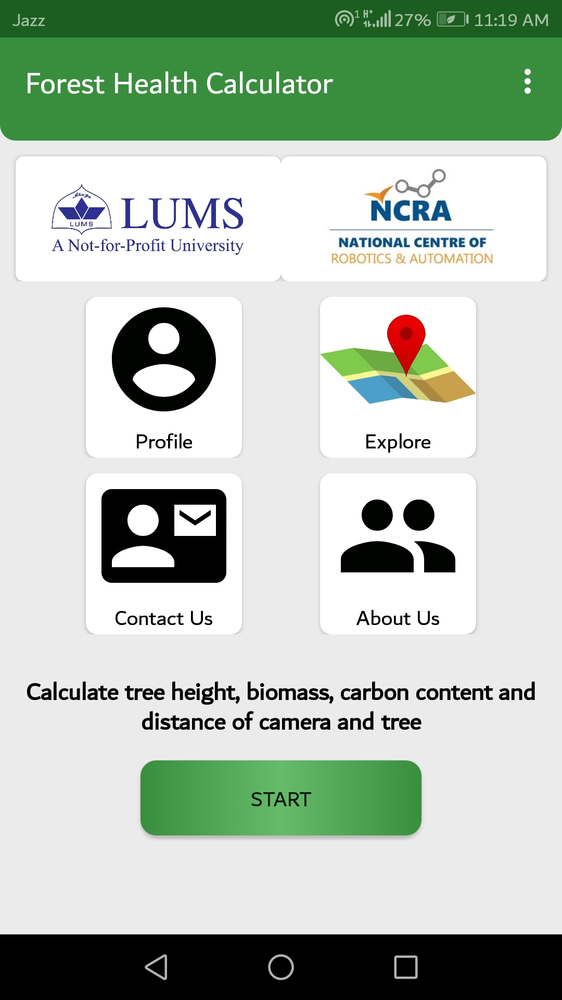

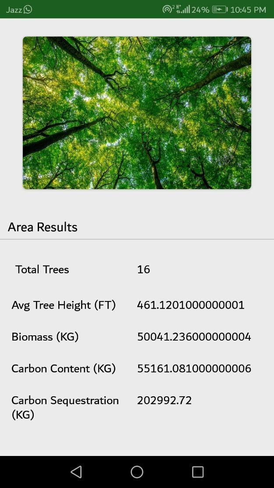

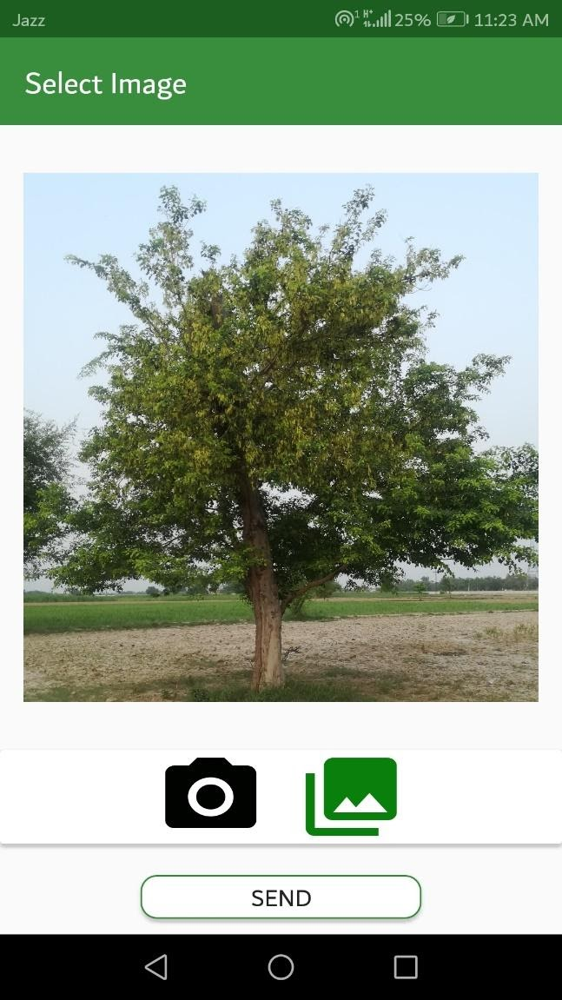

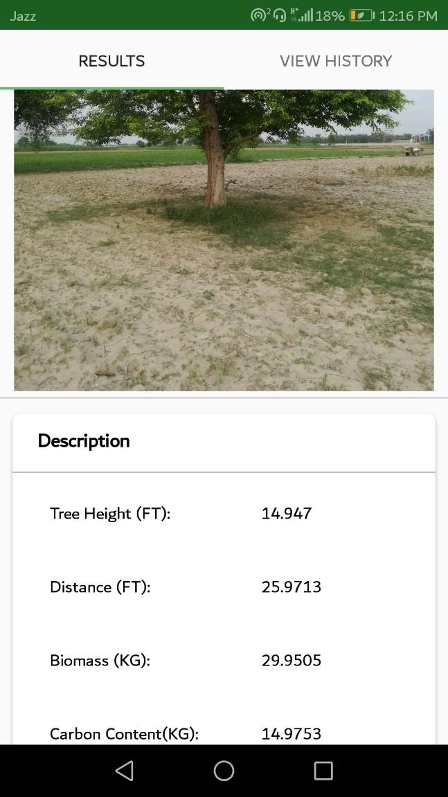

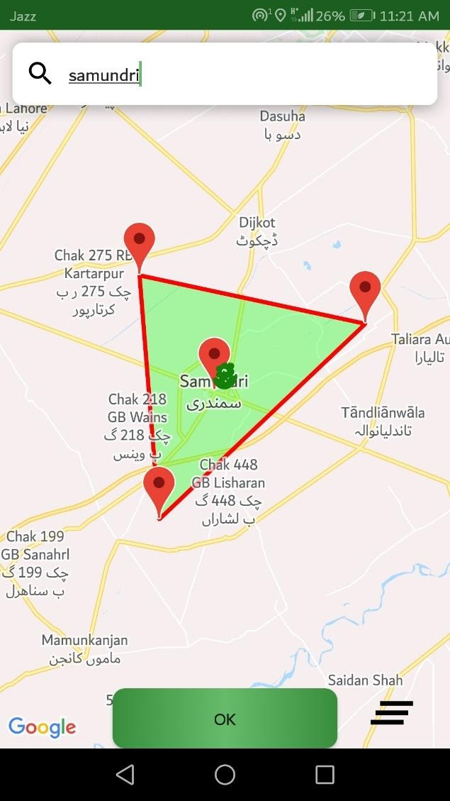

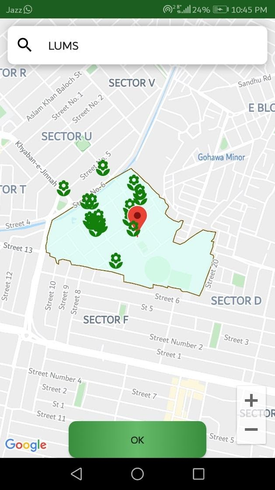

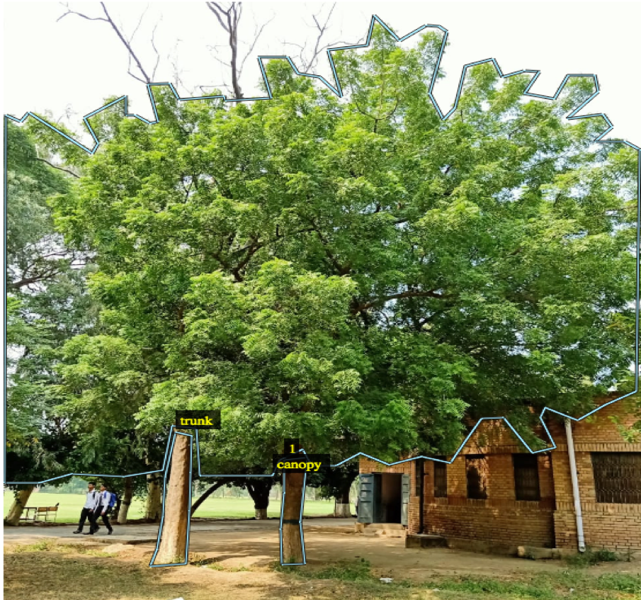

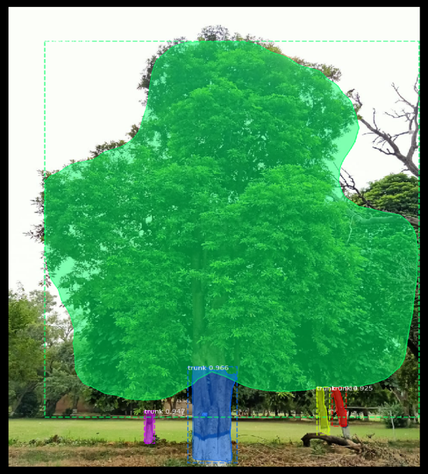

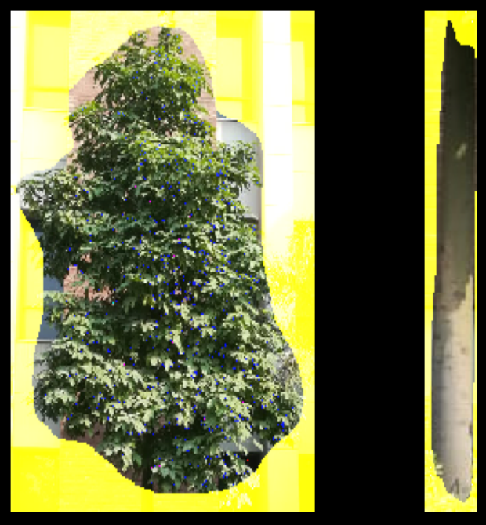

#### Multispectral Technology for forest identification:

We have been using multispectral images to identify the tree species in a certain area of interest and aim to develop a learning model to best classify the tree species. Initially, Sentinel-2 dataset has been used for getting LUMS and Changa Manga Forest satellite images. Three vegetation indices Normalized Difference Vegetation Index (NDVI), Normalized Difference Water Index (NDWI), Bare Soil Index (BSI) have been used for comparative studies of high/low vegetation, roads and buildings. The NDVI indices have proved to be promising as they all tend to align in terms of the maps generated. Furthermore, the overlay maps bolster this finding. Later we have added Duffer, Badwal, Ayubia and Mangroves forests. The NDVI results show that with the help of ground truth data provided by forest department, we will be able to use this inexpensive technology for forest inventory, canopy cover and tree counting manipulation. These would also contribute to species identification and forest maps generation. The area classification is done into high vegetation (dark green), low vegetation (light green), buildings (red), roads/pathways (grey) and water bodies (blue). Following are the two sample results:

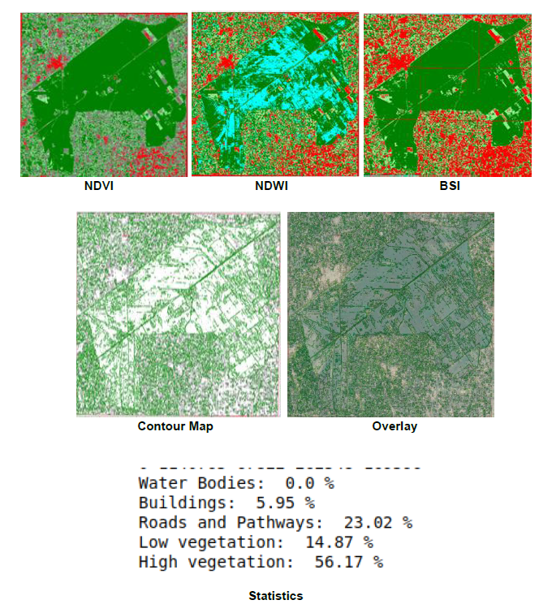

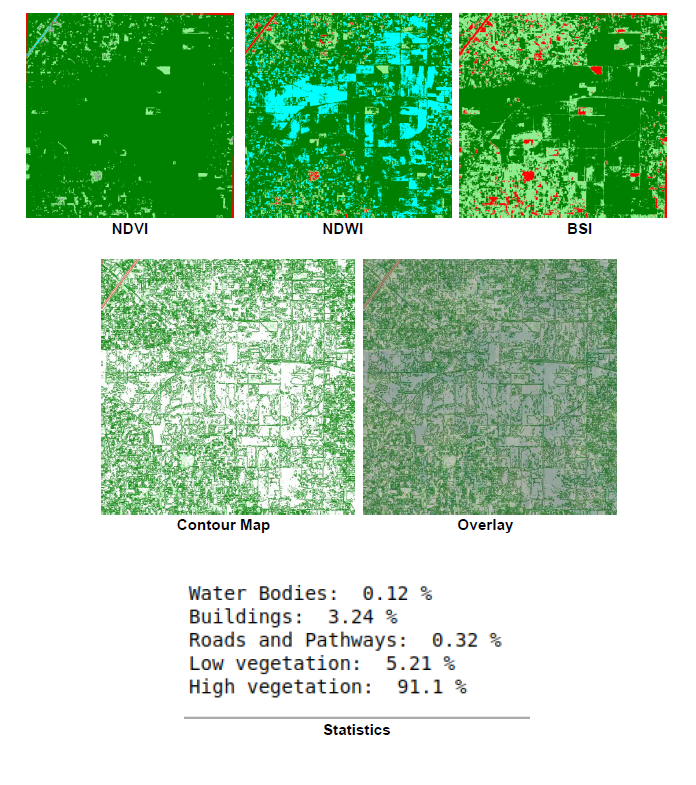

#### Incorporation of In-Situ Sensors:
In the meantime, we will install forest monitoring sensors like sap flow and dendrometers for data collection through cloud based environment, which will later be used for analysing forest health. 
The forest management system will integrate all these components to provide a complete forest health solution.  

#### Future Work:
1. Larger dataset collection with multiple and dense trees through in-situ sensors, camera and satellite images
2. Automated height, biomass, carbon content and other essential indices estimation through camera images
3. Data annotation and training with multiple algorithms
4. Accuracy and precision calculation of tested algorithms 
5. Results analysis and final method selection
6. Forest maps implantation on Pakistan’s map
7. Tree species identification through high resolution images